Path Tracer Part III: Multiple Importance Sampling and Microfacet Materials
======================

**University of Pennsylvania, CIS 561: Advanced Computer Graphics, Homework 6**

Result
------------

**PT_cornellBoxTwoLights.png**

Full Lighting Integrator(Power Heuristic)

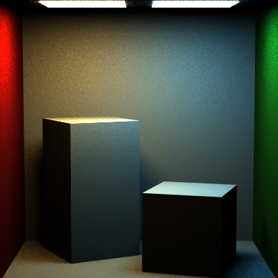

Full Lighting Integrator(Balance Heuristic)

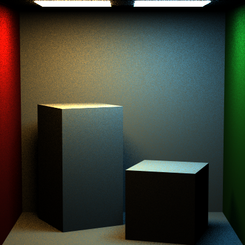

Direct Lighting Integrator

Naive Integrator

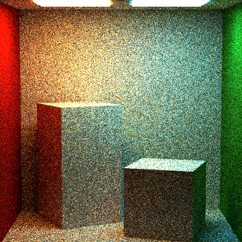

**PT_gradientMirrorBox.png**

Full Lighting Integrator

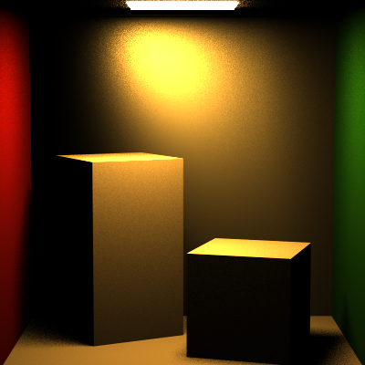

Direct Lighting Integrator

Naive Integrator

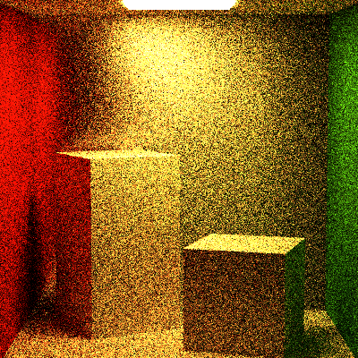

**PT_roughMirrorBoxMap.png**

Full Lighting Integrator

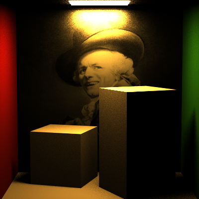

Direct Lighting Integrator

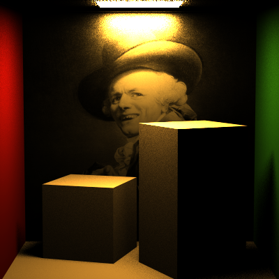

Naive Integrator

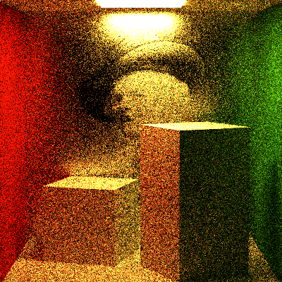

**PT_roughMirrorBoxUniform.png**

Full Lighting Integrator

Full Lighting Integrator(Balance Heuristic)

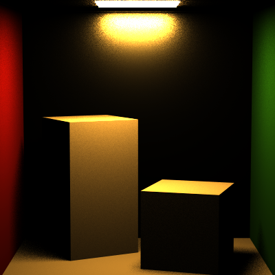

Direct Lighting Integrator

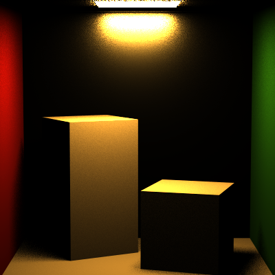

Naive Integrator

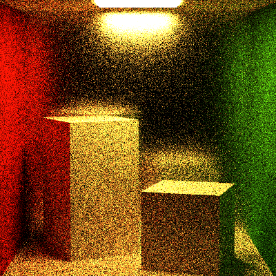

**PT_veachScene.png**

Full Lighting Integrator

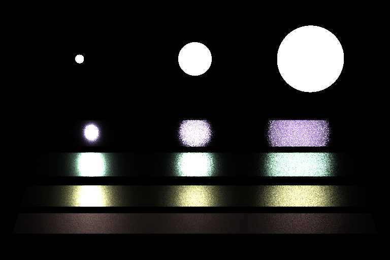

Direct Lighting Integrator

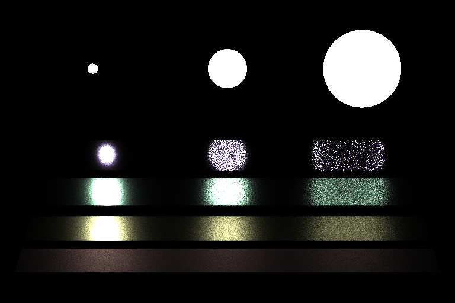

Naive Integrator

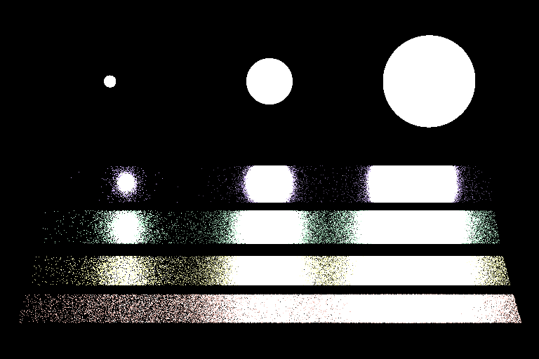
