Path Tracer Part IV: Global Illumination
======================

**University of Pennsylvania, CIS 561: Advanced Computer Graphics, Homework 7**

Result
------------

**PT_cornellBoxTwoLights.png**

Full Lighting Integrator

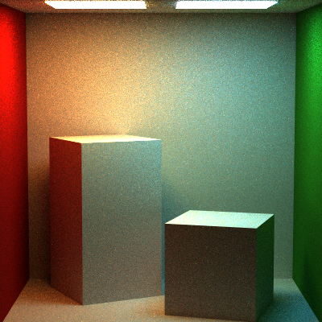

Multiple Impotance sampling 

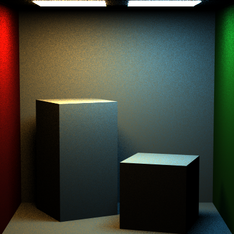

Direct Lighting Integrator

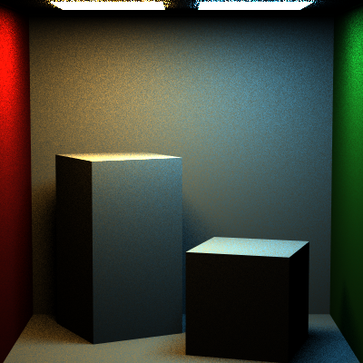

Naive Integrator

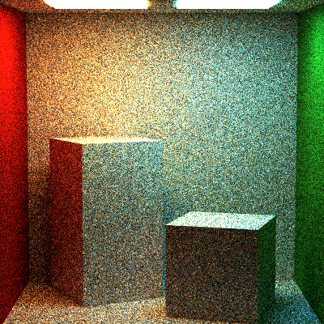

**PT_gradientMirrorBox.png**

Full Lighting Integrator

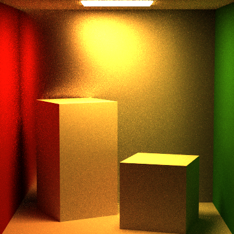

Multiple Impotance sampling 

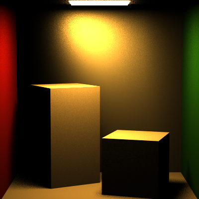

Direct Lighting Integrator

Naive Integrator

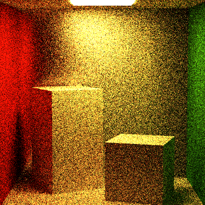

**PT_roughMirrorBoxMap.png**

Full Lighting Integrator

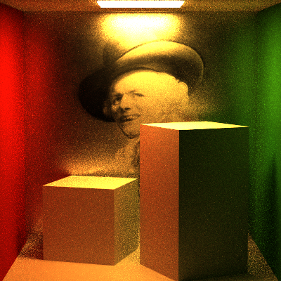

Multiple Impotance sampling 

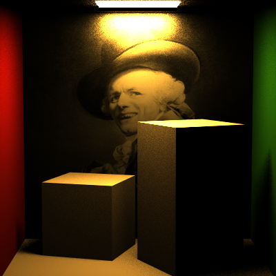

Direct Lighting Integrator

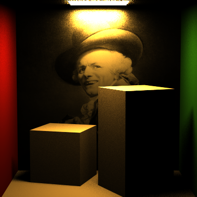

Naive Integrator

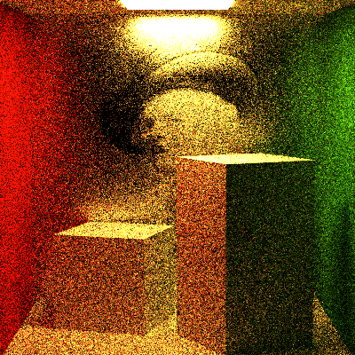

**PT_roughMirrorBoxUniform.png**

Full Lighting Integrator

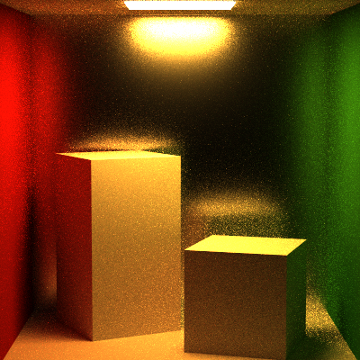

Multiple Impotance sampling 

Full Lighting Integrator(Balance Heuristic)

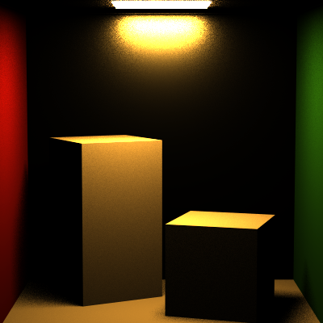

Direct Lighting Integrator

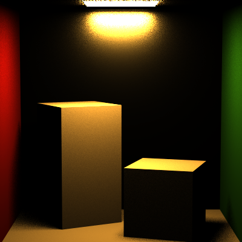

Naive Integrator

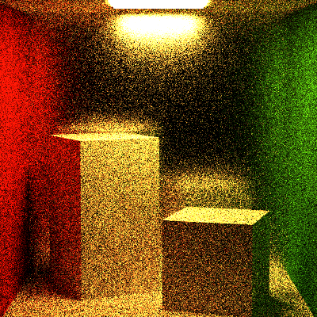

**PT_veachScene.png**

Full Lighting Integrator

Multiple Impotance sampling 

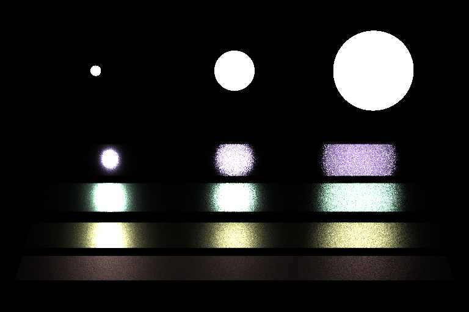

Direct Lighting Integrator

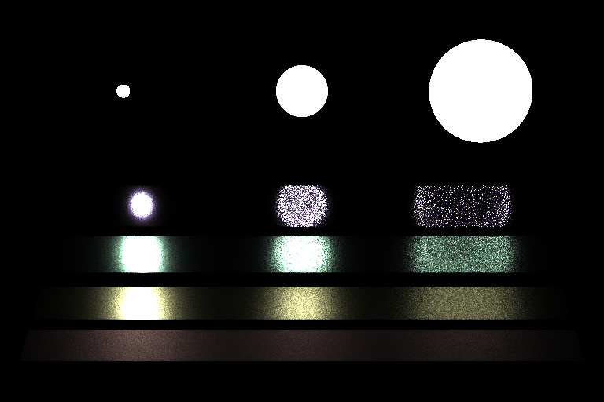

Naive Integrator

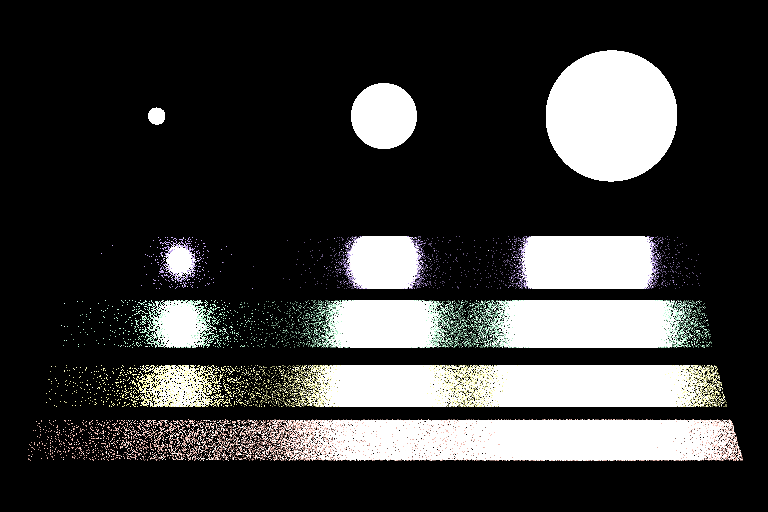

Custom Scenes (with 30 x 30 samples and 8 recursion limits)

Scene I: 
Walls are rough mirror.
A textured cube, a glass ellipsoid, and a rough mirror ball

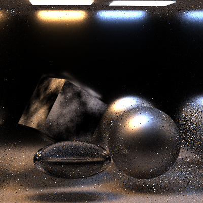

Scene II: 
Walls are texture mapped and normal mapped.
Two plastic cubes with different color.
A red glass ball.

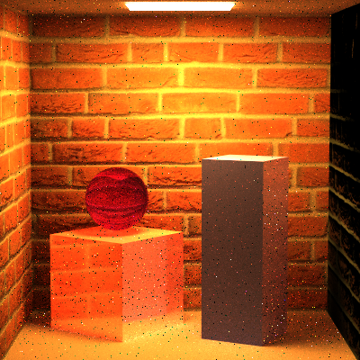

Scene III: 
The back wall is a rough mirror, and the others are textured mapped and normal mapped.
Three cubes with different roughness, which increases from top to bottom.
A green glass ball.

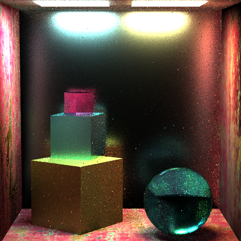

