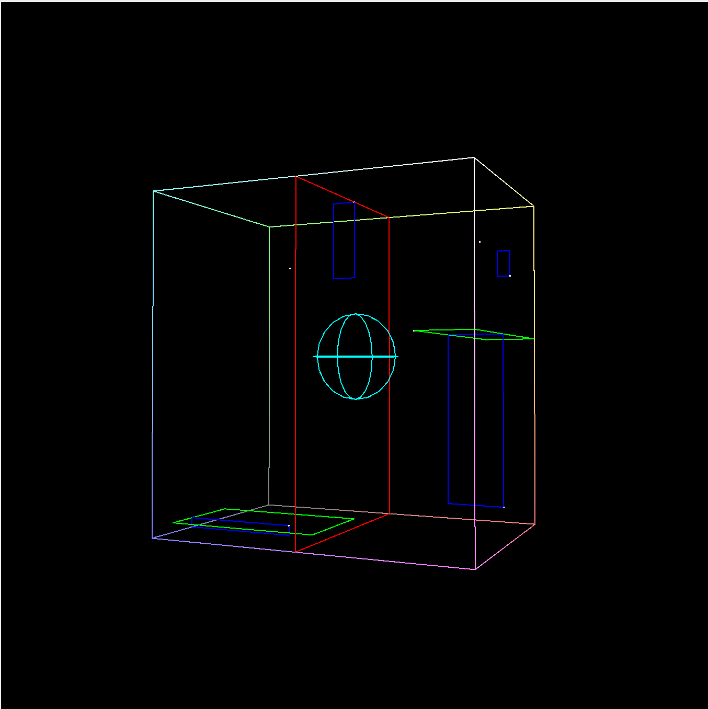
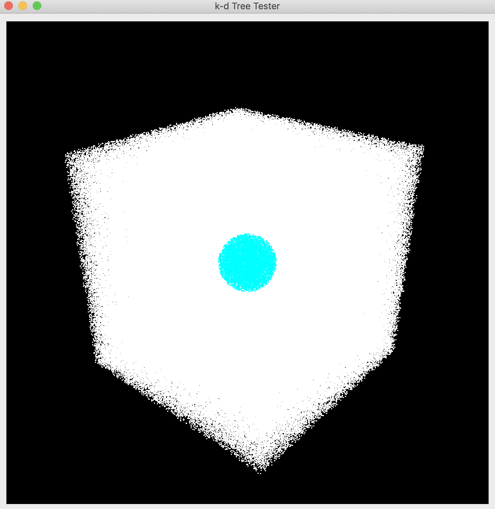
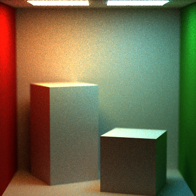
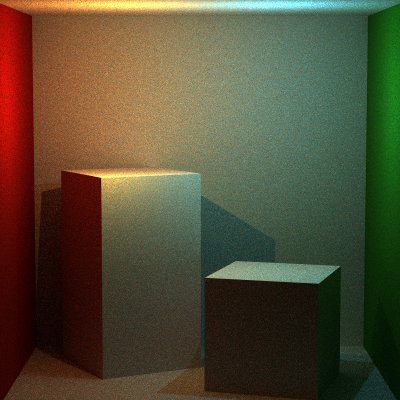
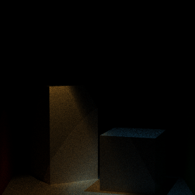

Making a k-d Tree
======================

**University of Pennsylvania, CIS 561: Advanced Computer Graphics, Homework 8**

Result
------------

**k-d Tree with 8 points**

**radius-test a set of one million points**

**Thin Lens Camera**

render of the two-lights Cornell Box scene with a focal length of 29.5 and lens radius of 1.5

render of the two-lights Cornell Box scene with a focal length of 29.5 and lens radius of 0.5

**cornellBoxTwoLights with PointLight**

**cornellBoxTwoLights with SpotLightLight**

