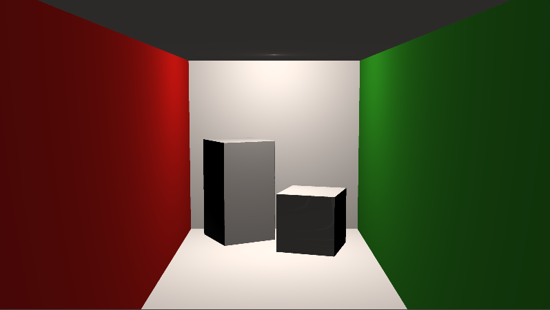
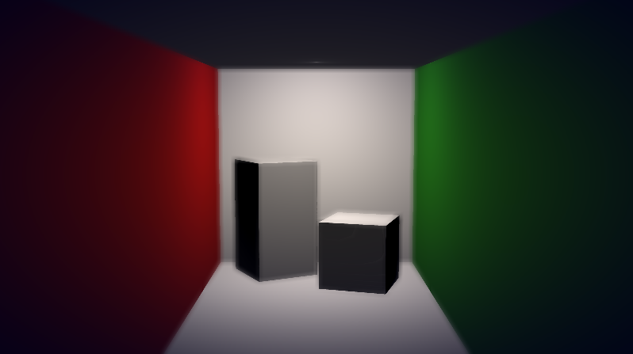
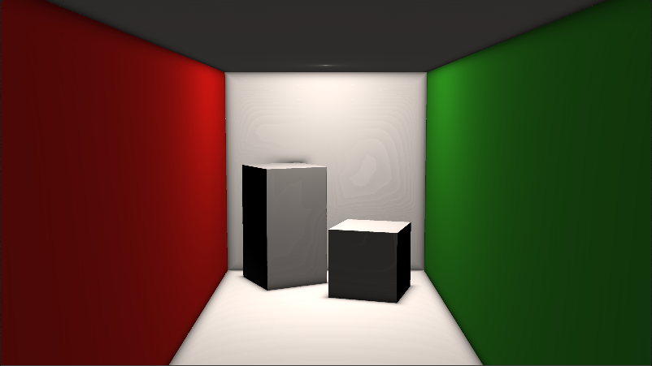
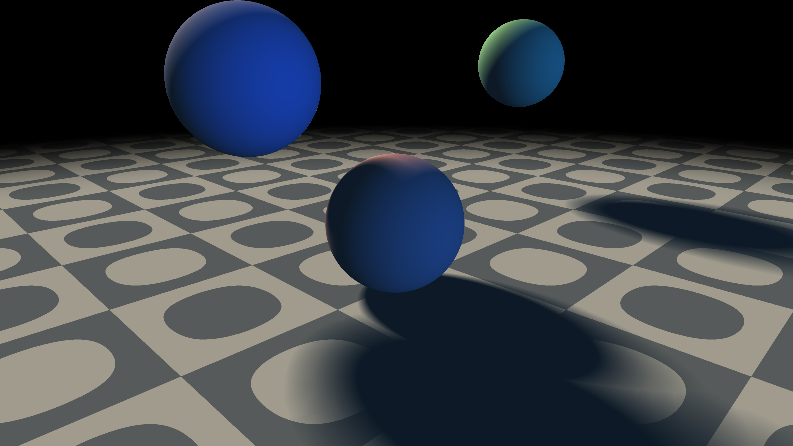

Real-Time Approximation of Physically-Based Effects
======================

**University of Pennsylvania, CIS 561: Advanced Computer Graphics, Homework 9**

Result
------------
**Name: Shijia Wang;  PennKey: wangshj9**
* [Re-making a Cornell Box](https://www.shadertoy.com/view/wsSyWG)
* [Post-Processed Depth of Field](https://www.shadertoy.com/view/3dsfRr)
* [Ambient Occlusion](https://www.shadertoy.com/view/tdfBzH)
* [Practice with Noise and UV Mapping](https://www.shadertoy.com/view/WdsfR8)
* [Subsurface Scattering Approximation](https://www.shadertoy.com/view/WslBR8)
* [Penumbra Shadows](https://www.shadertoy.com/view/3ssfz8)

Overview
---------
You will apply your knowledge of noise functions, raymarching, SDFs, and lighting to render scenes using
ShaderToy which showcase real-time approximations of physically-based effects.

After this homework will be the final project, for which one of the __options__ will be to use the techniques
you implement in this assignment to render a complex scene.

Provided code
------
Adam has created several example scenes on ShaderToy showcasing individual effects that you will use
in this assignment. You can find them listed below:
* [Approximating specular Fresnel materials](https://www.shadertoy.com/view/Wdj3RK)
* [Fake global illumination](https://www.shadertoy.com/view/wsBGDK)
* [Penumbra shadows](https://www.shadertoy.com/view/wsjGDG)
* [Post-processed depth-of-field](https://www.shadertoy.com/view/wsB3RK)
* [Ambient occlusion](https://www.shadertoy.com/view/3sB3zV)
* [Subsurface scattering approximation](https://www.shadertoy.com/view/wdSGWK)
* [Post-process color remapping](https://www.shadertoy.com/view/3sjGz3)
* [(Because I am proud of this one) Volcano lava simulation](https://www.shadertoy.com/view/WsSGDw)


Useful Reading
---------
We will not be referring to PBRT for much this assignment; there are some
online blog posts you may find useful
* [3D SDFs](https://www.iquilezles.org/www/articles/distfunctions/distfunctions.htm)
* [Penumbra shadows](https://www.iquilezles.org/www/articles/rmshadows/rmshadows.htm)
* [Better distance fog](https://www.iquilezles.org/www/articles/fog/fog.htm)
* [Outdoor lighting](https://www.iquilezles.org/www/articles/outdoorslighting/outdoorslighting.htm)

However, PBRT's Chapter 3 on shapes and texture mapping will prove useful.

Notes on WebGL
---------------
WebGL is very particular about numeric literals. If you are assigning a floating-point
number a value, it must have a decimal point or it will not compile. For example,
`float x = 10;` will not compile because you're assigning an `int` literal to a `float`.
`float x = 10.0;` __will__ compile because the literal type and variable type match.

Additionally, functions in WebGL (also true for OpenGL) can output values through
function arguments. Take the following code for example:
```
float testFunc(in vec3 a, out float z) {
	z = a.z * 2.0;
	return a.x * a.y;
}
```
This function effectively has two outputs: the return value, and `z`. Consider taking
advantage of this feature when writing your ray marcher code.

You can also write your own `struct`s in GLSL. Take a look at the `Intersection` struct
used in many of the ShaderToy examples linked above, and consider using something similar
in your own ray marcher code.


Set up a ShaderToy account
-----------
You will be making several different WebGL demos for this assignment, and will be hosting
them on [ShaderToy](https://www.shadertoy.com/). Sign up for an account so that you
can save your shaders for submission.

Re-making a Cornell Box (N points)
---------
To get some practice, make a ShaderToy shader that renders the default Cornell Box
scene using ray marching with Box and Plane SDFs. Treat the light source as a point
light rather than an area light to improve your render time. Further, do not bother
to compute any shadows cast by objects; you may just perform Lambertian shading.
We just want you to practice rendering a scene you are familiar with using SDFs and
ray marching.



Post-Processed Depth of Field (N points)
------------
Take the Cornell Box scene you rendered and use ShaderToy's frame buffer feature
to apply post-process based depth of field blurring.

To begin, take your Cornell Box rendering code and output it from a secondary
frame buffer (e.g. Buffer A) rather than the default frame buffer (Image). In
the default frame buffer tab, have it read the output of Buffer A from iChannel0.

In order to approximate the depth of field blurring effect in your default frame
buffer, you will need to pass additional information from Buffer A. Ultimately, in
the default buffer you will use a `t` value to interpolate each pixel between its
unblurred state and a blurred state depending on its `Intersection`'s distance from
the focal plane. To determine this distance, add code to Buffer A that computes the
vector from the Camera's position to the point of intersection for each pixel. Then,
compute the dot product of this vector with the Camera's forward vector. This
effectively measures how far along the Camera's look vector the `Intersection` lies.
Once you have this dot product, you can convert it to an interpolation
`t` value with this formula: `abs(distAlongCamZ - FOCAL_LENGTH) / FOCAL_RANGE)`.
In the formula, `FOCAL_LENGTH` is the distance from the Camera at which the focal plane
lies, and `FOCAL_RANGE` determines the distance along which the scene transitions from
fully clear to fully blurred (this is the non-physically-accurate part, as there is never
an "end" to increasing blurriness in a physically-based lens camera).

Finally, use ShaderToy's `iTime` variable to animate the location of the focal plane over
time to take advantage of the real-time rendering aspect.

For more obvious blurring, you'll likely want a Gaussian kernel of at least 11x11, and a
sigma of around 20.0.



Ambient Occlusion (N points)
--------
Use the "five-tap" ambient occlusion approximation formula discussed in the lecture slides to
fake the blocking of light that objects that are close together apply to one another. In the
example render below, an occlusion distance of 0.15 and a k-value of 2.0 were used. You need not
use these constants in your render, but we provide them if you want to test your implementation.



Practice with Noise and UV Mapping (N points)
-----------
If you took CIS 560, you have already had practice using noise functions to generate height fields
and textures. However, some of you have not taken this course, and it's been several months since
the Fall semester so it's worthwhile to practice using noise.

Use the following combinations of noise functions and UV mapping in one ShaderToy shader to texture
a scene of your own creation. 
* 2D worley noise mapped to a plane
* 2D fractal brownian motion with 4 octaves mapped to a sphere
* 3D Perlin noise applied to the surface of a box (no UV mapping necessary)

Further, rather than directly using the output of these noise functions as a greyscale color, you
should map their output to some color function. For example, you might use a
[cosine color palette](http://www.iquilezles.org/www/articles/palettes/palettes.htm)
to map your noise to a gradient, or a simple if-else chain to bucket your noise into colors.

Finally, you should animate these noise functions using `iTime` to displace them over time.

Subsurface Scattering Approximation (N points)
----------
Implement the approximation of subsurface scattering discussed in the lecture slides in
a ShaderToy shader. You may apply this to any scene you wish, whether it is a
new scene or one of the scenes you rendered for a different feature.

Below is an example render from the subsurface scattering ShaderToy shader linked above.


Penumbra Shadows (N points)
--------------
Implement the penumbra shadows approximation of soft shadows discussed in the lecture slides.
As with your subsurface scattering approximation, you may apply this effect to any scene.




Extra Credit (30 points max)
------------
* (15 points) Use ShaderToy's secondary frame buffer system to create highly approximated
global illumination. Create a raymarched image that consists solely of secondary
illumination by doing the following: for each ray intersection with the scene, cast
N rays randomly in the hemisphere. For each ray, determine what it hits and compute the
direct lighting for that surface, then store that for the primary ray hit. Average the
N rays' contributions for each primary hit. Then, in another secondary buffer blur the
image you produced with these hemisphere samples to reduce noise. Finally, your overall
output image in the default frame buffer should be the sum of the blurred global illumination
image and the "regular" render of your scene.
* (15 points) Incorporate a heterogeneous participating medium into a render. Take a look at
[this ShaderToy demo](https://www.shadertoy.com/view/4sjfzw) for one example, as well
as Norm's slides on volumetric rendering for some volume shading formulas.
* (10 points) Render your scene with colors outside the range [0, 1] and remap to incorporate
_High Dynamic Range_ into your renders. Grade your colors using gamma correction to further
tweak the "photorealism" of your renders.

Submitting your project
--------------
Make sure that you fill out this `README.md` file with your name and PennKey. You should
copy the code used in each ShaderToy shader into individual `.txt` files named with the
features used in each shader.

Additionally, add links to each of your ShaderToy shaders in this readme, noting
which features each shader incorporated.
